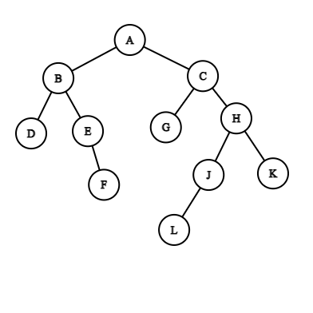
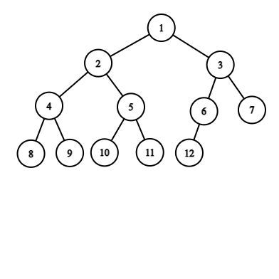
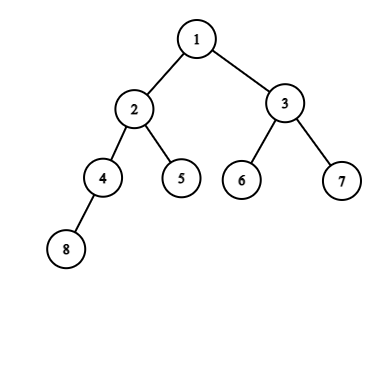
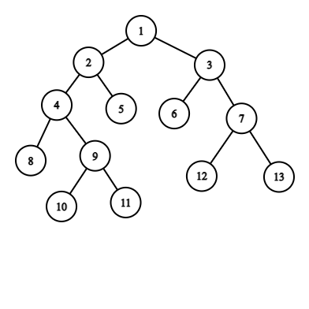
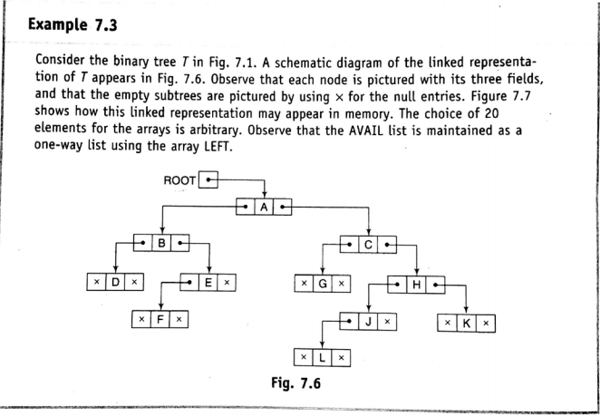
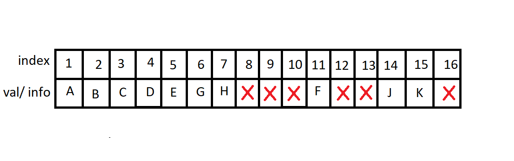
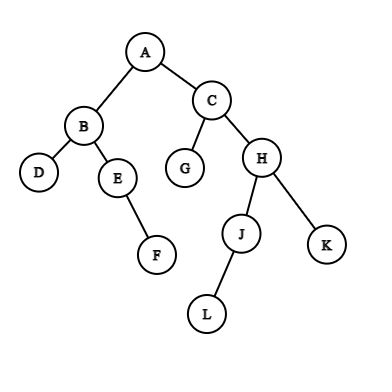

# Tree  

## Binary Tree

A binary tree is a tree which nodes contain maximum 2 children. That means it can contain 1 or 2 or 0 children.  

For example:  

> Some keywords:  

- Null tree or Empty tree : A tree with zero nodes in the tree
- Left successor : left child
- Right successor : right child
- Left subtree
- Right subtree
- Terminal nodes : A node which has no successor
- Similar and Copies

Example of Similar and Copies:

>Terminology  

- Parent / father
- Child / son
- siblings / brother : 2 nodes are siblings if their parent are same
- predecessor
- descendant : bongshodhor
- ancestor
- path : graph er path er moto
- leaf : terminal node
- branch : a path ending in a leaf
- Level number : root er level number 0, tader children er level number 1. children der children er level number 2. evabe cholte thakbe
- Generation : duita node er level number ek hole tara eki generation er.
- Depth / height : maximum number of nodes in a branch of tree.

### Complete Binary Tree

Ekta complete binary tree er prottek level purno thake. Bam theke purno hoye hoye dane jay. N node er binary tree er structure unique. Mane etake onno kunu vabe aka jabe na. R tree te kunu node insert korle seta ek level purno na kore onno level e giye boste parbe na.   
Example:  

_Hacks:_ If any complete binary tree has n nodes then its depth will be   

Dn = floor( log2n +1 ) 
  

### Extended Binary Tree

Extended binary tree er prottek node er hoy 2 ta child thakbe ba kunu child thakbe na.  
Example:  

## Representing binary trees in memory  
### Linked representation
In C++ we can use linked list to store binary tree. We can make a struct node which contain three things ; info of the node, pointer of the left child of the node , pointer of the right child of the node and if needed we can keep a pointer of parent of the node. We also need a pointer to indicate the root of the tree.
  
### Sequential representation
Sequential representation e sob data gula rakhar jonno shudhu ekta array use kora hoy.  
Erokom representation e root ke array er index 1 e rakha hoy. Prottek node er left child oi node er (index * 2) index e thakbe r right child (index * 2)+1 index e thakbe. R kunu node er parent holo oi node er floor(index/2).  

**Example:**
E er right child holo F. E er index holo 5, so right child er index = 2*5 + 1= 11 and F er index o 5  
E er parent er index = floor(5/2) = 2 , ja B er index. R jr index gulay kunu element nai, oiguly amra domain er bairer kunu man diye initialize kore dite pari. Ekhane cross diye seta buzanu hoyese

  

## Traversing Binary Trees
### Preoder Traverse
1. Processes the root
2. Traverse the left sub tree of the root in preorder
3. Traverse the right sub tree of the root in preorder  

### Inorder Traverse
1. Traverse the left sub tree of the root in inorder
2. Processes the root
3. Traverse the right sub tree of the root in inorder  

### Postorder Traverse
1. Traverse the left sub tree of the root in postorder
2. Traverse the right sub tree of the root in postorder  
3. Processes the root

Lets traverse the binary tree below in preorder, inorder and postorder and print their node value for better understanding.
   

>Preorder  

A B D E F C G H J K L

>Inorder

D B F E A G C L J H K

>Postorder  

D F E B G L J K H C A
