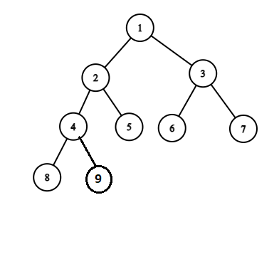

# Tree

## Binary Tree

A binary tree is a tree which nodes contain maximum 2 children. That means it can contain 1 or 2 or 0 children.

For example:

> Some keywords:

- Null tree or Empty tree : A tree with zero nodes in the tree
- Left successor : left child
- Right successor : right child
- Left subtree
- Right subtree
- Terminal nodes : A node which has no successor
- Similar and Copies

Example of Similar and Copies:

>Terminology

- Parent / father
- Child / son
- siblings / brother : 2 nodes are siblings if their parent are same
- predecessor
- descendant : bongshodhor
- ancestor
- path : graph er path er moto
- leaf : terminal node
- branch : a path ending in a leaf
- Level number : root er level number 0, tader children er level number 1. children der children er level number 2. evabe cholte thakbe
- Generation : duita node er level number ek hole tara eki generation er.
- Depth / height : maximum number of nodes in a branch of tree.

### Complete Binary Tree

Ekta complete binary tree er prottek level purno thake. Bam theke purno hoye hoye dane jay. N node er binary tree er structure unique. Mane etake onno kunu vabe aka jabe na. R tree te kunu node insert korle seta ek level purno na kore onno level e giye boste parbe na.
Example:

_Hacks:_ If any complete binary tree has n nodes then its depth will be

Dn = floor( log2n +1 ) 

### Extended Binary Tree

Extended binary tree er prottek node er hoy 2 ta child thakbe ba kunu child thakbe na.
Example:

## Representing binary trees in memory
### Linked representation
In C++ we can use linked list to store binary tree. We can make a struct node which contain three things ; info of the node, pointer of the left child of the node , pointer of the right child of the node and if needed we can keep a pointer of parent of the node. We also need a pointer to indicate the root of the tree.

### Sequential representation
Sequential representation e sob data gula rakhar jonno shudhu ekta array use kora hoy.
Erokom representation e root ke array er index 1 e rakha hoy. Prottek node er left child oi node er (index * 2) index e thakbe r right child (index * 2)+1 index e thakbe. R kunu node er parent holo oi node er floor(index/2).

**Example:**
E er right child holo F. E er index holo 5, so right child er index = 2*5 + 1= 11 and F er index o 5
E er parent er index = floor(5/2) = 2 , ja B er index. R jr index gulay kunu element nai, oiguly amra domain er bairer kunu man diye initialize kore dite pari. Ekhane cross diye seta buzanu hoyese

## Traversing Binary Trees
### Preoder Traverse
1. Processes the root
2. Traverse the left sub tree of the root in preorder
3. Traverse the right sub tree of the root in preorder

### Inorder Traverse
1. Traverse the left sub tree of the root in inorder
2. Processes the root
3. Traverse the right sub tree of the root in inorder

### Postorder Traverse
1. Traverse the left sub tree of the root in postorder
2. Traverse the right sub tree of the root in postorder
3. Processes the root

Lets traverse the binary tree below in preorder, inorder and postorder and print their node value for better understanding.

>Preorder

A B D E F C G H J K L

>Inorder

D B F E A G C L J H K

>Postorder

D F E B G L J K H C A

__________________________

# Binary Search Tree
Its a binary tree in which every node's left child's value is less than the node value and right child's value is greater than the node value(We can keep the equal value to the right child). See the figure .

>Remark

It also enable use to search for and find an element with an average running time f(n) = O(log2n). It also enable us to insert and delete any element easily. With an average complexity(for insertion) O(log2n)

>Insertion

To insert any value x in BST first we compare the root value with x. If root_val>x then we traverse to the left child, otherwise we traverse to the right child. Then we compare the node it traversed to and traverse again and take to its appropriate position.

>Search

Searching in BST is similar to inserting. In insertion we traverse the tree and find the appropriate position for the value to be inserted. Here we traverse the tree and compare the node value if it is equal to the value what we are searching for.

>Deletion

There are three cases for deleting a node from BST
1. if the node N has no children, then simply make the location null. That means if N was the left child of parent node, make the left child pointer null. If the right child, then make the right null.
2. if the node N has one child, then replace the node N with child and then delete N.
3. if the node N has two child then we have to find the inorder successor of node N, then replace the inorder successor with N and then delete N. To find the inorder successor of N first we traverse to the right of N, then we traverse to(sometimes we do not need to traverse, if the node has no left child) left until we get the left child of the node NULL. That node will be Inorder successor of node N. After replacing The inorder successor and node N, we can delete the node N. The deletion of N will be in case 1 or 2.

# AVL Tree(Adelson-Velskii-Landis)
If we insert a sorted sequence in BST(insert 1,2,3,4,5,6 .... or 6,5,4,3,2,1) then the tree will be right skewed or left skewed and the complexity of insertion and searching will be O(n) instead of O(log2n). So to keep the complexity less Adelson Velskii Landis intruduced AVL trees. It also called Balanced Binary Tree.

A binary tree is an AVL tree if and only if the balance factor of all nodes are either -1 or 0 or 1.

>Balance factor

Balance factor of a node is an integer value which is
BF = dL - dR
&nbsp;&nbsp;&nbsp;&nbsp; = (depth of left sub tree - depth of right sub tree).

>AVL Tree Insertion

To keep balance of the AVL tree, after insertion if the tree become unbalanced then the tree got rotated. There are 4 types of rotation in insertion:-
1. LL rotation
2. RR rotation
3. LR rotation
4. RL rotation

## LL Rotation

## RR Rotation

## LR Rotation

## RL Rotation

>AVL Tree Deletion

To keep balance of the AVL tree, after deleting a node if the tree become unbalanced then the tree got rotated. There are 6 type of rotation in deletion:-
1. R0
2. R1
3. R-1
4. L0
5. L1
6. L-1
